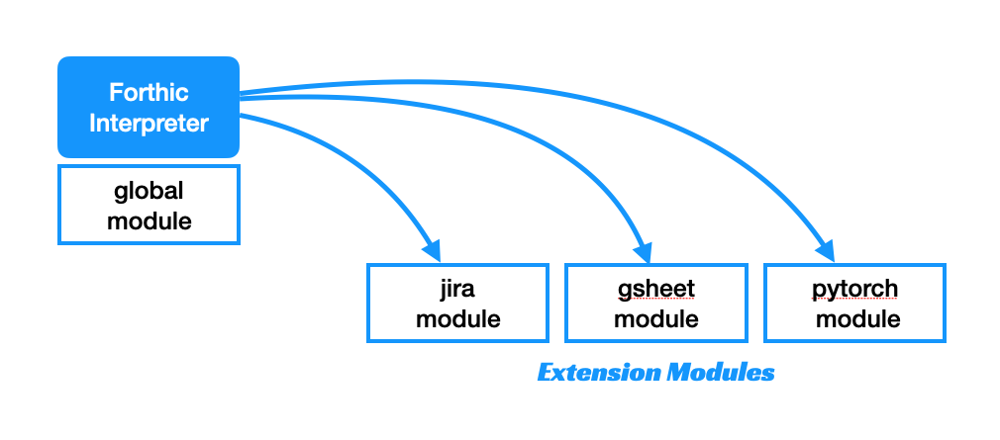
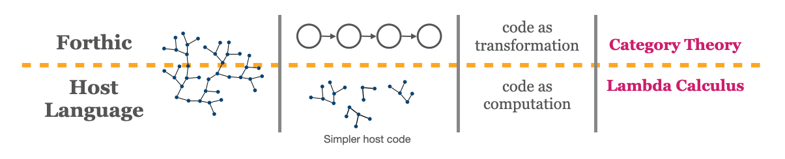

# Forthic Architecture

## Interpreter code architecture

A Forthic interpreter relies on the language that it's implemented in (its "host language") to
provide low level support. The `global module` implements generic words like `MAP` and `ZIP` which
can be used to manipulate data in a common way.

Application-specific words are implemented in the host language as "extension modules".
These become accessible to the interpreter as any other word but can provide direct access
to language-specific features. The Forthic interpreter becomes a way to dispatch commands at runtime.

In order to use an extension module, it must be registered with an interpreter. This must be done at build
time in order to create custom interpreters with varying levels of capability (e.g., some interpreters should
have very little privileged access if it deals directly with end user input).

## Application architecture

All "low level" code is in the host language implementation. This includes `if` statements and `loops`.
Forthic doesn't have them by design, because it was meant to run in straight lines without branching.
The Forthic layer of an application can be thought of as the "application layer". Code in the Forthic layer is more akin to
"transformation" than computation. In fact, the Forthic part of an app can be viewed as a "category" from category theory.
Well-designed Forthic applications have clean "categorical" implementations and structures. Likewise, the "host language" part of an application resembles traditional programs and is focused more on computing results.

By dividng a program this way, we can simplify both sides. When you keep "computation" out of the application layer,
you can code at a higher level and focus on categorical designs. When you keep the application out of the computation layer,
you can focus on implementing reusable components and avoid artifically coupling code.

